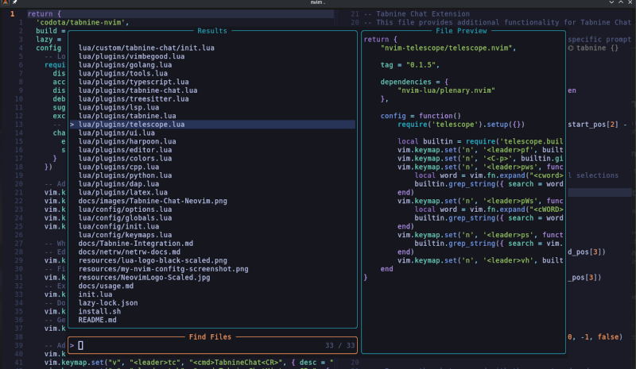

# Neovim Config



## Table of Contents
- [About this config](#about-this-config)
- [Supported Languages](#supported-languages)
- [Pre-install Requirements](#pre-install-requirements)
- [Installation](#installation)
- [Post Install](#post-install)
- [Netrw - Getting Started](#netrw---getting-started)
- [Remaps & Shortcuts](#remaps--shortcuts)
- [Moving lines Up & Down](#moving-lines-up--down)
- [Highlight Replace](#highlight-replace)
- [Netrw Cheat Sheet](#netrw-cheat-sheet)
- [Detailed Config and Tabnine Integration](docs/usage.md)
- [Tabnine Integration Separate Documentation](docs/Tabnine-Integration.md)

## About this config:

There are countless Neovim configurations out there.
Throughout my Neovim config journey, one of the biggest frustrations has been the lack of strict or standardized
architecture—and no universal templates to follow.

Yes, the high-level overview is consistent: Neovim looks for `init.lua` in `$XDG_CONFIG_HOME/nvim`,
and your Neovim environment spawns from there. However, from that point on, things can go in many different directions.

Understanding the *code flow* of other people's Neovim configurations often requires significant time and mental
overhead—depending on their complexity.

Part of my goal in creating this configuration was not only to build something that works best for me,
but also to provide comprehensive and detailed documentation.

This is something others can use and follow when creating their own config—similar in spirit to [kickstart.nvim](https://github.com/nvim-lua/kickstart.nvim).
Take what you like from mine; leave what you don’t.

It's my hope that by leaving detailed blueprints, it will be easy for anyone to *leggo* their own Neovim configuration environment.

Enjoy!

<br>

## Supported Languages.
### Be if you do not have all of these langs installed, the config will still work, but throw errors
 - Python3
 - Lua
 - JavaScript/TypeScript
 - HTML/CSS
 - Rust
 - Go
 - C/C++
 - Shell Scripting
 - JSON/YAML
 - Markdown
 - Docker
 - Solidity
 - Vue/Svelte
 - TOML

#### The install script will take care of most of the dependencies; however check your version of Neovim first.
```bash
  nvim -v
```

#### Should be Version 10 or higher

  * The repos tend to have older versions. But you can still try it.
  * [This config was built using Neovim version 11.2 - And built from source - latest stable version](https://github.com/neovim/neovim/blob/master/BUILD.md)
  * And built on Debian 12
  * [Using lazy.nvim for plugin management](https://lazy.folke.io/)
  * [ripgrep](https://github.com/BurntSushi/ripgrep#installation) is required for multiple [telescope](https://github.com/nvim-telescope/telescope.nvim#suggested-dependencies) pickers.
  * [ShellCheck](https://github.com/koalaman/shellcheck)
  * If you are having issues with [Tree-Sitter](https://github.com/tree-sitter/tree-sitter), then you might not have [node js](https://nodejs.org/en/download) installed. The two quick solution to try are:
  * `sudo apt install tree-sitter-cli` if that doesn't work, then you may need to install [Node.js](https://nodejs.org/en/download)
  * `sudo apt install nodejs npm` then Install Tree-sitter CLI globally with npm:
  * `sudo npm install -g tree-sitter-cli`
  * Verify the installation and restart NeoVim
  * `tree-sitter --version`
  * This config comes configured with [Tabnine Auto Completion](https://github.com/codota/tabnine-nvim)

<br>

## Installation

> **NOTE**
**Back up your current Neovim config if you want.
```bash
cp your_nvim_conf your_nvim_conf-bk
```


- #### Then Copy-paste this curl command in your terminal, press Enter, and follow the prompts.
- #### This will auto-remove your current Neovim config, install this one and open `nvim` to install plugins.
```bash

curl -LO https://raw.githubusercontent.com/LinuxUser255/nvim/refs/heads/main/install.sh; chmod +x install.sh; ./install.sh

```

<br>


**Neovim's configurations are located under the following paths, depending on your OS:**

| OS    | PATH                                      |
| :---- | :---------------------------------------- |
| Linux | `$XDG_CONFIG_HOME/nvim`, `~/.config/nvim` |
| MacOS | `$XDG_CONFIG_HOME/nvim`, `~/.config/nvim` |

<br>

## Post Install

**Open Neovim**
---


- The regular way
```sh
  nvim
```

<br>

- The [netrw](https://neovim.io/doc/user/pi_netrw.html) way
```sh
  nvim .
```

<br>

- Sync [Lazy](https://lazy.folke.io/)
```sh
  nvim --headless "+Lazy! sync" +qa
```

<br>


### Netrw - Getting Started - How to use this config

**For details see the [netrw documentation](docs/netrw/netrw-docs.md)**

<br>

### Remaps & Shortcuts:


***The spacebar is the leader key***

| Command          | Description                            |
|------------------|----------------------------------------|
| `leader pv`      | **Enter Project View**                 |
| `leader ve`      | **Split windows vertically**           |
| `leader he`      | **Split windows horizontally**         |
| `Ctrl l`         | **Jumps to the Right window**          |
| `Ctrl h`         | **Jumps to the Left window**           |
| `Ctrl o`         | **Increase window width by 3 columns** |
| `Ctrl y`         | **Decrease window width by 3 columns** |
| `leader tt`      | **Open Telescope**                     |
| `leader ff`       | **Find file using Telescope**          |


<br>


### This one's really unique: Moving lines Up & Down
- Higlight the line, `Shift v`, then while holding down Shift, press `j` to go down
- And `k` to move up.
- This also works with muliple lines selected simultanuiously

| Command              | Description                            |
|----------------------|----------------------------------------|
| `Shift v Shift j`    |  **Moves seclected line down**         |
| `Shift v Shift k`    |  **Moves seclected line up**           |

<br>

### Highlight Replace
| Command       | Description                                                  |
|--------------------------|---------------------------------------------------|
| `Shift s`                |  **Deletes the line and goes into insert mode.**  |                |

## See the cheat sheet below, for more usage info

## [Netrw Cheat Sheet](https://github.com/LinuxUser255/BashAndLinux/tree/main/NeovimCheatSheets)

## [Tabnine Integration Separate Documentation](docs/Tabnine-Integration.md)

<br>

<br>
