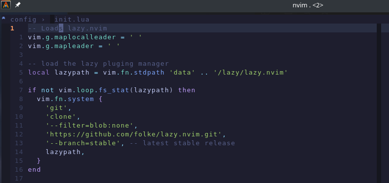

# Neovim Config




## Table of Contents
- [Supported Languages](#supported-languages)
- [Pre-install Requirements](#pre-install-requirements)
- [Installation](#installation)
- [Post Install](#post-install)
- [Netrw - Getting Started](#netrw---getting-started)
- [Remaps & Shortcuts](#remaps--shortcuts)
- [Moving lines Up & Down](#moving-lines-up--down)
- [Highlight Replace](#highlight-replace)
- [Netrw Cheat Sheet](#netrw-cheat-sheet)


## Supported Languages
 - Python3
 - Lua
 - JavaScript/TypeScript
 - HTML/CSS
 - Rust
 - Go
 - C/C++
 - Shell Scripting
 - JSON/YAML
 - Markdown
 - Docker
 - Solidity
 - Vue/Svelte
 - TOML

## Pre-install Requirements:
  * [Neovim version 10 & higher](https://github.com/neovim/neovim/blob/master/BUILD.md)
  * [lazy.nvim for plugin management](https://lazy.folke.io/)
  * Neovim version: I suggest [building the latest stable version from source.](https://github.com/neovim/neovim/blob/master/BUILD.md) The pkgs in the repos are older.
  * [ripgrep](https://github.com/BurntSushi/ripgrep#installation) is required for multiple [telescope](https://github.com/nvim-telescope/telescope.nvim#suggested-dependencies) pickers.
  * [ShellCheck](https://github.com/koalaman/shellcheck)
  * If you are having issues with [Tree-Sitter](https://github.com/tree-sitter/tree-sitter), then you might not have [node js](https://nodejs.org/en/download) installed. The two quick solution to try are:
  * `sudo apt install tree-sitter-cli` if that doesn't work, then you may need to install [Node.js](https://nodejs.org/en/download)
  * `sudo apt install nodejs npm` then Install Tree-sitter CLI globally with npm:
  * `sudo npm install -g tree-sitter-cli`
  * Verify the installation and restart NeoVim
  * `tree-sitter --version`
  * This config comes configured with [Tabnine Auto Completion](https://github.com/codota/tabnine-nvim)

<br>

## Installation

> **NOTE**
> [Backup](#FAQ) your previous configuration (if any exists)

<br>

- **Remove your current/previous neovim files and dirs.**
```bash
rm -rf ~/.config/nvim; rm -rf ~/.local/share/nvim
```

<br>

- **Linux and Mac install. Plug n play - Copy past the git clone command below**
- **type `nvim`, the plugins will load, and that's it!**
```bash
git clone https://github.com/LinuxUser255/nvim.git "${XDG_CONFIG_HOME:-$HOME/.config}"/nvim
```

<br>


**Neovim's configurations are located under the following paths, depending on your OS:**

| OS    | PATH                                      |
| :---- | :---------------------------------------- |
| Linux | `$XDG_CONFIG_HOME/nvim`, `~/.config/nvim` |
| MacOS | `$XDG_CONFIG_HOME/nvim`, `~/.config/nvim` |

<br>

## Post Install

**Open Neovim**

- The regular way
```sh
nvim
```


- The [netrw](https://neovim.io/doc/user/pi_netrw.html) way
```sh
nvim .
```


- Sync [Lazy](https://lazy.folke.io/)
```sh
nvim --headless "+Lazy! sync" +qa
```

<br>


### Netrw - Getting Started - How to use this config

***For details see the [netrw documentation](docs/netrw/netrw-docs.md)***

### Remaps & Shortcuts:

<br>

***The spacebar is the leader key***

| Command          | Description                            |
|------------------|----------------------------------------|
| `leader pv`      | **Enter Project View**                 |
| `leader ve`      | **Split windows vertically**           |
| `leader he`      | **Split windows horizontally**         |
| `Ctrl l`         | **Jumps to the Right window**          |
| `Ctrl h`         | **Jumps to the Left window**           |
| `Ctrl o`         | **Increase window width by 3 columns** |
| `Ctrl y`         | **Decrease window width by 3 columns** |
| `leader tt`      | **Open Telescope**                     |
| `leader ff`       | **Find file using Telescope**          |


<br>


### This one's really unique: Moving lines Up & Down
- Higlight the line, `Shift v`, then while holding down Shift, press `j` to go down
- And `k` to move up.
- This also works with muliple lines selected simultanuiously

| Command              | Description                            |
|----------------------|----------------------------------------|
| `Shift v Shift j`    |  **Moves seclected line down**         |
| `Shift v Shift k`    |  **Moves seclected line up**           |

<br>

### Highlight Replace
| Command       | Description                                                  |
|--------------------------|---------------------------------------------------|
| `Shift s`                |  **Deletes the line and goes into insert mode.**  |                |

## See the cheat sheet below, for more usage info

## [Netrw Cheat Sheet](https://github.com/LinuxUser255/BashAndLinux/tree/main/NeovimCheatSheets)

<br>

<br>
