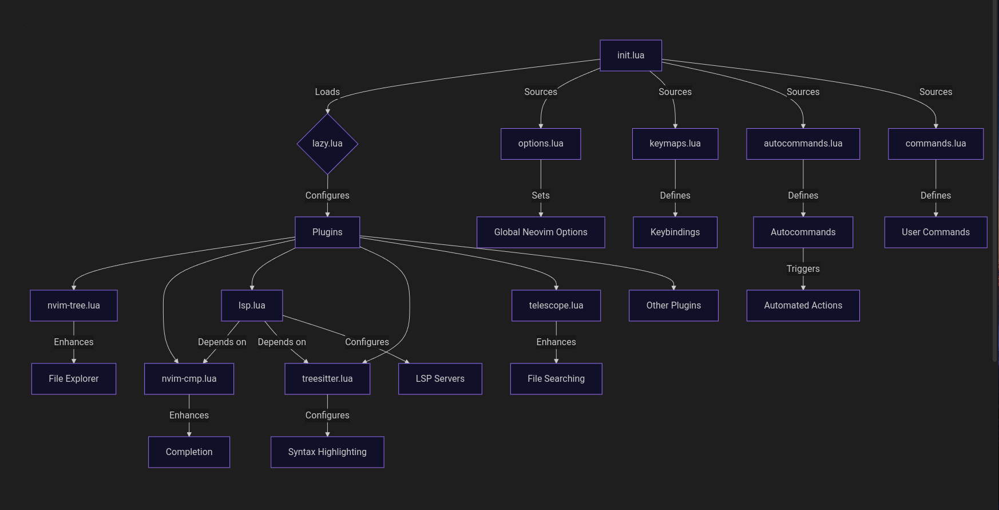

# How This Neovim Configuration Works

*A note on all of this:*
There are countless Neovim configurations out there.
Throughout my Neovim config journey, one of the biggest frustrations has been the lack of strict or standardized architecture—and no universal templates to follow.

Yes, the high-level overview is consistent: Neovim looks for `init.lua` in `$XDG_CONFIG_HOME/nvim`,
and your Neovim environment spawns from there.
However, from that point on, things can go in many different directions.

Understanding the *code flow* of other people's Neovim configurations often requires significant time and mental overhead—depending on their complexity.

Part of my goal in creating this configuration was not only to build something that works best for me,
but also to provide comprehensive and detailed documentation.

This is something others can use and follow when creating their own config—similar in spirit to [kickstart.nvim](https://github.com/nvim-lua/kickstart.nvim).
Take what you like from mine; leave what you don’t.

It's my hope that by leaving detailed blueprints, it will be easy for anyone to *leggo* their own Neovim configuration environment.


## Overview of Configuration Structure


<br>



<br>

### Deep Technical Dive into this Neovim Configuration

A modular Lua-based setup that leverages the `lazy.nvim` plugin manager to
organize plugins and configuration files. 
Description of  each file, how they interact, and how they collectively form a cohesive Neovim
environment. The repository contains the following key files under the `lua`
directory: `autocommands.lua`, `commands.lua`, `keymaps.lua`, `lazy.lua`,
`options.lua`, and plugin-specific configurations under `plugins/` (`lsp.lua`,
`nvim-cmp.lua`, `nvim-tree.lua`, `telescope.lua`, `treesitter.lua`). I'll also
reference common Neovim practices and insights from the provided web results
where relevant.

#### Directory Structure
The configuration follows a standard Neovim Lua-based structure:
- `init.lua`: The entry point of the configuration.
- `lua/`: Contains all Lua modules.
  - `autocommands.lua`: Defines autocommands for automated behavior.
  - `commands.lua`: Defines custom user commands.
  - `keymaps.lua`: Defines keybindings.
  - `lazy.lua`: Configures the `lazy.nvim` plugin manager.
  - `options.lua`: Sets global Neovim options.
  - `plugins/`: Contains plugin-specific configurations.
    - `lsp.lua`: Configures Language Server Protocol (LSP) integration.
    - `nvim-cmp.lua`: Configures completion with `nvim-cmp`.
    - `nvim-tree.lua`: Configures the file explorer.
    - `telescope.lua`: Configures the fuzzy finder.
    - `treesitter.lua`: Configures syntax highlighting and other Tree-sitter features.

#### File Interactions and Functionality

1. **init.lua**
   - **Purpose**: This is the main entry point for the Neovim configuration. It is automatically sourced when Neovim starts and is responsible for loading all other configuration modules.
   - **Interactions**:
     - Sources `lua/options.lua` to set global Neovim options (e.g., `vim.opt` settings like line numbers, tab width, etc.).
     - Sources `lua/keymaps.lua` to define keybindings.
     - Sources `lua/autocommands.lua` to set up autocommands.
     - Sources `lua/commands.lua` to define custom user commands.
     - Sources `lua/lazy.lua` to initialize the `lazy.nvim` plugin manager, which loads and configures all plugins.
   - **Role**: Acts as the orchestrator, ensuring that all configuration components are loaded in the correct order. It typically contains minimal logic, delegating most functionality to the sourced files.

2. **lua/options.lua**
   - **Purpose**: Sets global Neovim options using `vim.opt` or `vim.g`. Examples include settings for appearance (e.g., `vim.opt.number = true` for line numbers), editing behavior (e.g., `vim.opt.tabstop = 2`), and performance (e.g., `vim.opt.updatetime = 300`).
   - **Interactions**: Directly modifies Neovim's global state, affecting the editor's behavior across all buffers and plugins. These settings are applied early in the startup process by `init.lua` to ensure they take effect before plugins are loaded.
   - **Example Impact**: If `options.lua` enables `termguicolors` (`vim.opt.termguicolors = true`), it ensures that plugins like `nvim-tree` and `treesitter` can use 24-bit color for icons and highlighting.[](https://github.com/nvim-tree/nvim-tree.lua)

3. **lua/keymaps.lua**
   - **Purpose**: Defines custom keybindings using `vim.keymap.set`. These mappings allow users to trigger actions like opening the file explorer, invoking Telescope, or running LSP commands.
   - **Interactions**:
     - May reference plugin APIs (e.g., `nvim-tree.api` or `telescope.builtin`) to create plugin-specific keybindings.
     - Interacts with `nvim-tree.lua` by defining shortcuts like `<leader>e` to toggle the file explorer.[](https://medium.com/%40shaikzahid0713/file-explorer-for-neovim-c324d2c53657)
     - Interacts with `telescope.lua` by mapping keys to Telescope pickers (e.g., `<leader>ff` for file finding).
   - **Example**: A mapping like `vim.keymap.set('n', '<leader>e', '<cmd>NvimTreeToggle<cr>', { desc = 'Toggle File Explorer' })` integrates with the `nvim-tree` plugin to toggle the file explorer.[](https://medium.com/%40shaikzahid0713/file-explorer-for-neovim-c324d2c53657)

4. **lua/autocommands.lua**
   - **Purpose**: Defines autocommands using `vim.api.nvim_create_autocmd` to automate tasks based on events (e.g., `BufEnter`, `BufWritePost`).
   - **Interactions**:
     - May interact with plugins like `nvim-tree` to refresh the file explorer on buffer changes or `treesitter` to handle folding.[](https://github.com/nvim-treesitter/nvim-treesitter/wiki/Installation)
     - Could set up LSP diagnostics to update on file save or configure buffer-specific settings.
   - **Example**: An autocommand might refresh `nvim-tree` when a file is written (`BufWritePost`) to keep the explorer in sync with the filesystem.[](https://nix-community.github.io/nixvim/plugins/nvim-tree/index.html)

5. **lua/commands.lua**
   - **Purpose**: Defines custom user commands using `vim.api.nvim_create_user_command`. These commands provide shortcuts for complex actions (e.g., `:MyCustomCommand` to run a specific plugin function).
   - **Interactions**: May call functions from plugins like `nvim-tree`, `telescope`, or custom Lua modules. For example, a command might invoke `require('nvim-tree.api').tree.toggle()` to open/close the file explorer.[](https://raw.githubusercontent.com/kyazdani42/nvim-tree.lua/master/doc/nvim-tree-lua.txt)
   - **Role**: Enhances usability by providing command-line access to plugin functionality or custom scripts.

6. **lua/lazy.lua**
   - **Purpose**: Configures the `lazy.nvim` plugin manager, which is responsible for installing, updating, and loading all plugins.
   - **Interactions**:
     - Specifies a list of plugins to install, including `nvim-tree.lua`, `nvim-cmp`, `nvim-lspconfig`, `nvim-treesitter`, and `telescope.nvim`.
     - Sources plugin configurations from `lua/plugins/*.lua` after plugins are loaded.
     - Configures lazy-loading strategies to optimize startup time (e.g., loading plugins on specific events or keybindings).
   - **Example**: The file likely contains a call like `require('lazy').setup({ ... })`, where the plugin list includes entries like `{ 'nvim-tree/nvim-tree.lua', config = function() require('plugins.nvim-tree') end }`.[](https://docs.astronvim.com/)

7. **lua/plugins/nvim-tree.lua**
   - **Purpose**: Configures the `nvim-tree.lua` plugin, a file explorer for Neovim written in Lua.[](https://github.com/nvim-tree/nvim-tree.lua)
   - **Interactions**:
     - Depends on `nvim-web-devicons` for file and folder icons, which requires a Nerd Font to be installed and configured in the terminal.[](https://github.com/nvim-tree/nvim-web-devicons)[](https://github.com/nvim-tree/nvim-tree.lua/blob/master/doc/nvim-tree-lua.txt)
     - Configures options like view settings (e.g., `view.side = 'left'`, `view.width = 30`), renderer settings (e.g., icons, git status), and keybindings via `on_attach`.[](https://github.com/nvim-tree/nvim-tree.lua)
     - Integrates with `keymaps.lua` for custom mappings (e.g., `<C-t>` to change root, `?` for help).[](https://github.com/nvim-tree/nvim-tree.lua)
     - May interact with `autocommands.lua` to refresh the tree on filesystem changes.
   - **Example Configuration**:
     ```lua
     require('nvim-tree').setup({
       view = { width = 30, side = 'left' },
       renderer = { group_empty = true, icons = { show = { git = true, file = true, folder = true } } },
       filters = { dotfiles = false },
       on_attach = function(bufnr)
         local api = require('nvim-tree.api')
         vim.keymap.set('n', '<C-t>', api.tree.change_root_to_parent, { buffer = bufnr, desc = 'Up' })
       end
     })
     ```
   - **Role**: Provides a file explorer interface, replacing the default `netrw` plugin, with features like git integration and file operations (create, delete, rename).[](https://github.com/nvim-tree/nvim-tree.lua/blob/master/doc/nvim-tree-lua.txt)

8. **lua/plugins/nvim-cmp.lua**
   - **Purpose**: Configures the `nvim-cmp` plugin for autocompletion.
   - **Interactions**:
     - Depends on LSP servers configured in `lsp.lua` for LSP-based completion sources.
     - Integrates with `keymaps.lua` for completion keybindings (e.g., `<CR>` to confirm, `<Tab>` to navigate).
     - May use sources like `nvim-lsp`, `buffer`, `path`, and `luasnip` for completion candidates.
   - **Example Configuration**:
     ```lua
     local cmp = require('cmp')
     cmp.setup({
       sources = {
         { name = 'nvim_lsp' },
         { name = 'buffer' },
         { name = 'path' }
       },
       mapping = {
         ['<CR>'] = cmp.mapping.confirm({ select = true }),
         ['<Tab>'] = cmp.mapping.select_next_item()
       }
     })
     ```
   - **Role**: Enhances the editing experience with intelligent autocompletion for code, paths, and buffers.[](https://medium.com/%40shaikzahid0713/file-explorer-for-neovim-c324d2c53657)

9. **lua/plugins/lsp.lua**
   - **Purpose**: Configures LSP servers using `nvim-lspconfig` and related plugins.
   - **Interactions**:
     - Depends on `nvim-cmp` for completion capabilities (`cmp-nvim-lsp`).
     - Interacts with `keymaps.lua` to define LSP keybindings (e.g., `gd` for go to definition, `K` for hover).
     - May integrate with `treesitter.lua` for enhanced syntax awareness.
   - **Example Configuration**:
     ```lua
     local lspconfig = require('lspconfig')
     lspconfig.pyright.setup({
       capabilities = require('cmp_nvim_lsp').default_capabilities(),
       on_attach = function(client, bufnr)
         vim.keymap.set('n', 'gd', vim.lsp.buf.definition, { buffer = bufnr })
       end
     })
     ```
   - **Role**: Enables advanced language features like code navigation, diagnostics, and formatting for supported languages.[](https://medium.com/%40shaikzahid0713/file-explorer-for-neovim-c324d2c53657)

10. **lua/plugins/treesitter.lua**
    - **Purpose**: Configures `nvim-treesitter` for advanced syntax highlighting, indentation, and other Tree-sitter features.[](https://github.com/nvim-treesitter/nvim-treesitter)
    - **Interactions**:
      - Depends on the Tree-sitter CLI for parser installation (`:TSInstall`).[](https://github.com/nvim-treesitter/nvim-treesitter)
      - Interacts with `lsp.lua` for enhanced LSP features (e.g., better code folding).
      - May interact with `autocommands.lua` to set up folding or context-aware features.[](https://github.com/nvim-treesitter/nvim-treesitter/wiki/Installation)
    - **Example Configuration**:
      ```lua
      require('nvim-treesitter.configs').setup({
        ensure_installed = { 'lua', 'python', 'javascript' },
        highlight = { enable = true },
        indent = { enable = true }
      })
      ```
    - **Role**: Provides modern syntax highlighting and code structure analysis, improving upon Neovim's default highlighting.[](https://github.com/nvim-treesitter/nvim-treesitter)

11. **lua/plugins/telescope.lua**
    - **Purpose**: Configures `telescope.nvim`, a fuzzy finder for files, buffers, and more.
    - **Interactions**:
      - Integrates with `keymaps.lua` for mappings like `<leader>ff` to find files or `<leader>fg` for git files.
      - May interact with `nvim-tree.lua` for file browsing or `lsp.lua` for LSP symbol searching.
    - **Example Configuration**:
      ```lua
      require('telescope').setup({
        defaults = {
          mappings = {
            i = { ['<C-j>'] = require('telescope.actions').move_selection_next }
          }
        }
      })
      ```
    - **Role**: Enhances navigation with powerful search and selection capabilities.[](https://www.reddit.com/r/neovim/comments/1eum82a/which_neovim_file_explorer_minifiles_or/)

#### How Everything Ties Together
- **Startup Sequence**:
  1. Neovim loads `init.lua`, which sources `options.lua`, `keymaps.lua`, `autocommands.lua`, `commands.lua`, and `lazy.lua`.
  2. `options.lua` sets global settings that affect all plugins and the editor's behavior.
  3. `lazy.lua` initializes the plugin manager, which loads plugins and their configurations from `plugins/*.lua`.
  4. Plugin configurations (`nvim-tree.lua`, `nvim-cmp.lua`, etc.) set up specific plugin behaviors and integrate with keybindings from `keymaps.lua`.
  5. `autocommands.lua` and `commands.lua` add automation and custom commands that enhance plugin functionality or editor behavior.

- **Plugin Ecosystem**:
  - **nvim-tree**: Provides a file explorer that replaces `netrw`, with keybindings defined in `keymaps.lua` and possible autocommands for refreshing.[](https://github.com/nvim-tree/nvim-tree.lua)
  - **nvim-cmp** and **lsp**: Work together to provide autocompletion and language server features, with `lsp.lua` configuring servers and `nvim-cmp.lua` handling completion UI.[](https://medium.com/%40shaikzahid0713/file-explorer-for-neovim-c324d2c53657)
  - **treesitter**: Enhances syntax highlighting and integrates with LSP for better code analysis.[](https://github.com/nvim-treesitter/nvim-treesitter)
  - **telescope**: Provides a unified search interface, complementing `nvim-tree` for file navigation and `lsp` for code navigation.[](https://www.reddit.com/r/neovim/comments/1eum82a/which_neovim_file_explorer_minifiles_or/)

- **Key Integrations**:
  - Keybindings in `keymaps.lua` tie plugins together by providing shortcuts to trigger actions (e.g., toggling `nvim-tree`, opening Telescope pickers, or invoking LSP functions).
  - Autocommands in `autocommands.lua` ensure plugins like `nvim-tree` and `treesitter` stay in sync with editor events (e.g., file changes, buffer switches).
  - `lazy.nvim` optimizes plugin loading, ensuring minimal startup time by lazy-loading plugins until needed (e.g., loading Telescope only when a picker is invoked).

- **Extensibility**:
  - The modular structure allows easy addition of new plugins by adding entries to `lazy.lua` and corresponding configuration files in `plugins/`.
  - Custom commands and autocommands can be extended in `commands.lua` and `autocommands.lua` to support new workflows.

#### Example Workflow
1. User starts Neovim, and `init.lua` loads all configurations.
2. `options.lua` sets `termguicolors` and other global settings, enabling rich visuals.
3. `lazy.lua` loads plugins, and `nvim-tree.lua` configures the file explorer to open on `<leader>e` (defined in `keymaps.lua`).
4. User presses `<leader>e`, and `nvim-tree` opens, displaying the file tree with icons from `nvim-web-devicons`.
5. User opens a Python file, triggering `lsp.lua` to attach the `pyright` LSP server and `nvim-cmp.lua` to provide completions.
6. `treesitter.lua` ensures syntax highlighting for Python code.
7. User presses `<leader>ff` to search for files using Telescope, configured in `telescope.lua`.
8. An autocommand in `autocommands.lua` refreshes `nvim-tree` when the file is saved.

<br>

