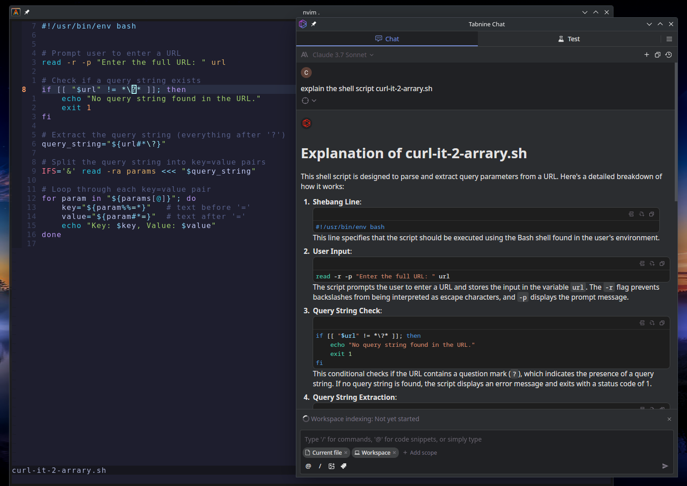

# Neovim Configuration Guide

This comprehensive guide covers the setup, usage, and customization of your Neovim configuration. 
It includes detailed instructions for LSP integration, debugging, and language-specific features with a focus on Python, C/C++.
And extensive documentation on [Tabnine](https://www.tabnine.com/) integration with Neovim

## Table of Contents

1. [Introduction](#introduction)
2. [Basic Usage](#basic-usage)
3. [Key Mappings](#key-mappings)
4. [LSP Configuration](#lsp-configuration)
5. [Completion and Snippets](#completion-and-snippets)
6. [Language-Specific Features](#language-specific-features)
   - [Python](#python)
   - [C/C++](#cc)
   - [Lua](#lua)
   - [TypeScript/JavaScript](#typescriptjavascript)
7. [Debugging](#debugging)
8. [Presentations](#presentations)
9. [Customization](#customization)
10. [Troubleshooting](#troubleshooting)
11. [Tabnine Neovim Integration](#tabnine-neovim-integration)

## Introduction

This Neovim configuration uses [lazy.nvim](https://github.com/folke/lazy.nvim) as the plugin manager and is organized into modular components. The configuration provides IDE-like features including:

- Language Server Protocol (LSP) integration
- Code completion
- Syntax highlighting via Treesitter
- Debugging capabilities
- File navigation and search
- Custom keymaps for efficient editing

## Basic Usage

### Starting Neovim

```bash
nvim                 # Open Neovim
nvim <filename>      # Open a specific file
nvim .               # Open the current directory
```

### Plugin Management

```bash
:Lazy               # Open the Lazy plugin manager interface
:Lazy install       # Install all configured plugins
:Lazy update        # Update plugins
:Lazy clean         # Remove unused plugins
:Lazy sync          # Sync plugins (update and clean)
:Lazy profile       # Show plugin load times
```

### Mason Package Management

```bash
:Mason              # Open the Mason package manager interface
:MasonInstall <pkg> # Install a specific package
:MasonUninstall <pkg> # Uninstall a specific package
:MasonUpdate        # Update all packages
```

## Key Mappings

### General Navigation

| Mapping | Mode | Description |
|---------|------|-------------|
| `<Space>` | All | Leader key |
| `<C-h>` | Normal | Move to left window |
| `<C-l>` | Normal | Move to right window |
| `<C-o>` | Normal | Increase window width by 3 columns |
| `<C-y>` | Normal | Decrease window width by 3 columns |
| `<C-d>` | Normal | Scroll down (cursor stays in middle) |
| `<C-u>` | Normal | Scroll up (cursor stays in middle) |

### File Navigation

| Mapping | Mode | Description |
|---------|------|-------------|
| `<leader>pv` | Normal | Open NetRW file explorer |
| `<leader>ve` | Normal | Open vertical split with NetRW |
| `<leader>he` | Normal | Open horizontal split with NetRW |
| `<leader>ff` | Normal | Find files with Telescope |
| `<leader>fg` | Normal | Live grep with Telescope |
| `<leader>/` | Normal | Fuzzy find in current buffer |
| `<leader>tt` | Normal | Open Telescope |

### Editing

| Mapping | Mode | Description |
|---------|------|-------------|
| `<leader>x` | Normal | Make file executable |
| `J` | Visual | Move selected line(s) down |
| `K` | Visual | Move selected line(s) up |
| `<leader>p` | Visual | Paste without overwriting register |
| `<leader>y` | Normal/Visual | Yank to system clipboard |
| `<leader>Y` | Normal | Yank line to system clipboard |
| `<leader>s` | Normal | Search and replace word under cursor |

### LSP Functionality

| Mapping | Mode | Description |
|---------|------|-------------|
| `gD` | Normal | Go to declaration |
| `gd` | Normal | Go to definition |
| `K` | Normal | Show hover information |
| `gi` | Normal | Go to implementation |
| `<C-k>` | Normal | Show signature help |
| `<leader>rn` | Normal | Rename symbol |
| `<leader>ca` | Normal/Visual | Code action |
| `gr` | Normal | Show references |
| `[d` | Normal | Go to previous diagnostic |
| `]d` | Normal | Go to next diagnostic |
| `<leader>e` | Normal | Show diagnostic in float window |
| `<leader>q` | Normal | Add diagnostic to location list |

### Debugging

| Mapping | Mode | Description |
|---------|------|-------------|
| `<F5>` | Normal | Continue/Start debugging |
| `<F10>` | Normal | Step over |
| `<F11>` | Normal | Step into |
| `<F12>` | Normal | Step out |
| `<Leader>b` | Normal | Toggle breakpoint |
| `<Leader>B` | Normal | Set conditional breakpoint |
| `<Leader>lp` | Normal | Set logpoint |
| `<Leader>dr` | Normal | Open debug REPL |
| `<Leader>dl` | Normal | Run last debug configuration |

## LSP Configuration

The LSP configuration is managed through the `lsp.lua` file and uses Mason for installing and managing language servers.

### Supported Language Servers

- `lua_ls`: Lua language server
- `pyright`: Python language server
- `clangd`: C/C++ language server
- `rust_analyzer`: Rust language server
- `bashls`: Bash language server
- `tsserver`: TypeScript/JavaScript language server

### Adding a New Language Server

To add a new language server, modify the `lsp.lua` file:

```lua
-- File: /home/linux/.config/nvim/lua/plugins/lsp.lua
-- Add to ensure_installed list
require("mason-lspconfig").setup({
    ensure_installed = {
        -- existing servers
        "new_language_server",
    },
    automatic_installation = true,
})

-- Add server-specific configuration
lspconfig.new_language_server.setup({
    -- Server-specific settings
    settings = {
        -- Configuration options
    },
})
```

## Completion and Snippets

Code completion is provided by `nvim-cmp` with integration for LSP, buffer, path, and snippet sources.

### Completion Keybindings

| Mapping | Mode | Description |
|---------|------|-------------|
| `<C-k>` | Insert | Select previous item |
| `<C-j>` | Insert | Select next item |
| `<C-b>` | Insert | Scroll docs backward |
| `<C-f>` | Insert | Scroll docs forward |
| `<C-Space>` | Insert | Show completion menu |
| `<C-e>` | Insert | Close completion menu |
| `<CR>` | Insert | Confirm selection |

<br>

### Customizing Completion

To modify completion behavior, edit the `lsp.lua` file:

```lua
-- File: /home/linux/.config/nvim/lua/plugins/lsp.lua
cmp.setup({
    -- Existing configuration
    
    -- Add or modify sources
    sources = cmp.config.sources({
        { name = "nvim_lsp" },
        { name = "luasnip" },
        { name = "buffer" },
        { name = "path" },
        -- Add new sources here
    }),
    
    -- Customize formatting
    formatting = {
        format = lspkind.cmp_format({
            maxwidth = 50,
            ellipsis_char = "...",
            -- Add custom formatting options
        }),
    },
})
```

<br>


## Language-Specific Features


### Python

Python support includes LSP integration via Pyright, debugging with DAP, and test running with Neotest.

#### Python LSP Configuration

```lua
-- File: /home/linux/.config/nvim/lua/plugins/lsp.lua
-- Python LSP configuration (pyright)
lspconfig.pyright.setup({
    settings = {
        python = {
            analysis = {
                typeCheckingMode = "basic",
                autoSearchPaths = true,
                useLibraryCodeForTypes = true,
                diagnosticMode = "workspace",
            },
            pythonPath = vim.fn.exepath("python3"),  -- Use Python 3
        },
    },
})
```

<br>

#### Python Debugging

To start debugging a Python file:

1. Set breakpoints with `<Leader>b`
2. Press `<F5>` to start debugging
3. Use `<F10>`, `<F11>`, and `<F12>` to step through code
4. View variables in the DAP UI

<br>

#### Running Python Tests

```bash
  :lua require("neotest").run.run()           # Run nearest test
  :lua require("neotest").run.run(vim.fn.expand("%")) # Run current file
  :lua require("neotest").run.run({strategy = "dap"}) # Debug nearest test
```

<br>

### C/C++

C/C++ support includes LSP integration via clangd, debugging with DAP, and enhanced features through clangd_extensions.

#### C/C++ LSP Configuration

```lua
-- File: /home/linux/.config/nvim/lua/plugins/lsp.lua
-- C/C++ LSP configuration (clangd)
lspconfig.clangd.setup({
    cmd = {
        "clangd",
        "--background-index",
        "--suggest-missing-includes",
        "--clang-tidy",
        "--header-insertion=iwyu",
    },
    filetypes = { "c", "cpp", "objc", "objcpp", "cuda", "proto" },
    root_dir = function(fname)
        return require("lspconfig.util").root_pattern(
            "compile_commands.json",
            "compile_flags.txt",
            ".git"
        )(fname) or vim.fn.getcwd()
    end,
    init_options = {
        compilationDatabasePath = "build",
    },
})
```

<br>

#### C/C++ Debugging

To debug a C/C++ program:

1. Set breakpoints with `<Leader>b`
2. Press `<F5>` to start debugging
3. Enter the path to the executable when prompted
4. Use `<F10>`, `<F11>`, and `<F12>` to step through code

<br>

#### Compilation Database

For best results with clangd, create a `compile_commands.json` file in your project:

```bash
# For CMake projects
cmake -DCMAKE_EXPORT_COMPILE_COMMANDS=ON .

# For Make projects, use Bear
bear -- make
```

<br>

### Lua

Lua support includes LSP integration via lua_ls and syntax highlighting via Treesitter.

#### Lua LSP Configuration

```lua
-- File: /home/linux/.config/nvim/lua/plugins/lsp.lua
-- Lua LSP configuration
lspconfig.lua_ls.setup({
    settings = {
        Lua = {
            runtime = { version = "Lua 5.1" },
            diagnostics = {
                globals = { "bit", "vim", "it", "describe", "before_each", "after_each" },
            },
        },
    },
})
```
<br>

### TypeScript/JavaScript

TypeScript and JavaScript support includes LSP integration via tsserver.

#### TypeScript LSP Configuration

```lua
-- File: /home/linux/.config/nvim/lua/plugins/lsp.lua
-- TypeScript LSP configuration
lspconfig.tsserver.setup({
    -- Add TypeScript-specific settings here
})
```

<br>

## Debugging

Debugging is provided through the Debug Adapter Protocol (DAP) with language-specific adapters.

### General Debugging Commands

```bash
  :lua require('dap').continue()              # Start/continue debugging
  :lua require('dap').step_over()             # Step over
  :lua require('dap').step_into()             # Step into
  :lua require('dap').step_out()              # Step out
  :lua require('dap').toggle_breakpoint()     # Toggle breakpoint
  :lua require('dap').set_breakpoint(vim.fn.input('Breakpoint condition: ')) # Set conditional breakpoint
```

<br>

## Presentations

Create and deliver presentations directly in Neovim using [present.nvim](https://github.com/tjdevries/present.nvim). Write your slides in markdown and present them without leaving your editor.

### Presentation Commands

| Command | Description |
|---------|-------------|
| `:PresentStart` | Start presentation mode |
| `<leader>ps` | Start presentation (shortcut) |

### Navigation During Presentation

| Key | Description |
|-----|-------------|
| `n` | Next slide |
| `p` | Previous slide |
| `q` | Quit presentation |

### Creating Presentations

1. **Write slides in Markdown**
   ```markdown
   # Slide 1 Title
   
   Content for slide 1
   
   <!-- stop -->
   
   # Slide 2 Title
   
   Content for slide 2
   ```

2. **Use slide separators**
   - `<!-- stop -->` splits content into slides
   - Each section between separators becomes a slide

3. **Add comments**
   - Use `%%` for comments that won't appear in presentation
   - Example: `%% This is a presenter note`

4. **Execute code blocks**
   - Code blocks can be executed during presentation
   - Supports Lua, Python, Bash, JavaScript, and more
   ```lua
   print("This code can be executed live!")
   ```

### Example Presentation

```markdown
# Welcome Slide

Introduction to my presentation

<!-- stop -->

## Main Points

- Point 1
- Point 2
- Point 3

%% Remember to emphasize Point 2

<!-- stop -->

## Code Demo

```lua
print("Live code execution!")
```

<!-- stop -->

# Thank You!

Questions?
```

<br>


3. Restart Neovim after building the binary

<br>

### Additional documentation
1. More detailed configuration options
2. Information about subscription tiers
3. Comprehensive troubleshooting steps
4. Privacy considerations
5. Examples of how to extend Tabnine functionality

## [Tabnine Neovim Integration](https://github.com/codota/tabnine-nvim/tree/master) 

**Tabnine provides AI-powered code completion and assistance features.**

### Tabnine Basic Features

| Mapping | Mode | Description |
|---------|------|-------------|
| `<Tab>` | Insert | Accept Tabnine suggestion |
| `<C-]>` | Insert | Dismiss Tabnine suggestion |
| `<leader>th` | Normal | Open Tabnine Hub |
| `<leader>tl` | Normal | Tabnine Login |
| `<leader>ts` | Normal | Tabnine Status |
| `<leader>tt` | Normal | Toggle Tabnine |
| `<leader>tn` | Normal | Next Tabnine suggestion |

<br>

### Tabnine Code Assistance

| Mapping | Mode | Description |
|---------|------|-------------|
| `<leader>tw` | Normal | Edit code with Tabnine |
| `<leader>tf` | Normal | Fix code with Tabnine |
| `<leader>te` | Normal | Explain code with Tabnine |
| `<leader>td` | Normal | Document code with Tabnine |
| `<leader>tg` | Normal | Generate test with Tabnine |

<br>

### [Tabnine Chat](https://github.com/codota/tabnine-nvim/tree/master?tab=readme-ov-file#tabnine-chat)

Tabnine Chat provides an interactive AI assistant for coding help directly in Neovim.

| Mapping | Mode | Description |
|---------|------|-------------|
| `<leader>tc` | Normal | Open Tabnine Chat |
| `<leader>tc` | Visual | Open Tabnine Chat with selected code |
| `<leader>tch` | Normal | View Tabnine Chat history |
| `<leader>tcn` | Normal | Start new Tabnine Chat session |

<br>

#### Using Tabnine Chat

1. Select code you want to discuss (optional)
2. Press `<leader>tc` to open Tabnine Chat
3. Type your question or request
4. Press Enter to send your message
5. View the AI response in the chat window
6. Continue the conversation as needed

Tabnine Chat can help with:
- Explaining code functionality
- Suggesting improvements
- Debugging issues
- Answering programming questions
- Providing code examples

**Note:** Tabnine Chat requires an active Tabnine account and may require a subscription for full functionality.

<br>

#### Advanced Tabnine Chat Commands

For convenience, several specialized Tabnine Chat commands are available:

| Mapping | Mode | Description |
|---------|------|-------------|
| `<leader>tce` | Normal/Visual | Explain code with Tabnine Chat |
| `<leader>tcr` | Normal/Visual | Refactor code with Tabnine Chat |
| `<leader>tco` | Normal/Visual | Optimize code with Tabnine Chat |
| `<leader>tcd` | Normal/Visual | Debug code with Tabnine Chat |

These commands automatically send your code to Tabnine Chat with specific prompts, saving you from typing common requests.

<br>

### Tabnine Chat Setup

If you encounter the error "Tabnine_chat binary not found", you need to build the chat binary:

1. Make sure you have Rust and Cargo installed:
```bash
  curl --proto '=https' --tlsv1.2 -sSf https://sh.rustup.rs | sh
  source $HOME/.cargo/env
  cargo build --release
 ```
   inside `chat/` directory

<br>

2. Navigate to the Tabnine chat directory and build the binary:
```bash
  cd ~/.local/share/nvim/lazy/tabnine-nvim/chat/
  cargo build --release
```

## Tabnine Configuration
You can customize Tabnine's behavior by modifying the configuration in `lua/plugins/tabnine.lua`:
```lua
require('tabnine').setup({
  disable_auto_comment = true,  -- Set to false to keep auto-comments
  accept_keymap = "<Tab>",      -- Change to your preferred key
  dismiss_keymap = "<C-]>",     -- Change to your preferred key
  debounce_ms = 800,            -- Adjust for performance vs. responsiveness
  suggestion_color = {gui = "#808080", cterm = 244},  -- Change suggestion color
  exclude_filetypes = {"TelescopePrompt"},  -- Add filetypes to exclude
})
```
<br>

### Troubleshooting Tabnine

**If you encounter issues with Tabnine, try the following:**

<br>

**1. Check Tabnine Status using this command in Neovim**
```bash
  :TabnineStatus
```
<br>

**2. Restart Tabnine:**
```bash
  :TabnineDisable
  :TabnineEnable
```
<br>

**3. Update Tabnine:**
```bash
  :Lazy update tabnine-nvim
```
<br>

**4. Clear Tabnine Cache:**
```base  
    rm -rf ~/.config/TabNine/
```
<br>

**5. Debug Tabnine:**
```bash
  :TabnineDebug
```

<br>

## Tabnine Privacy Considerations

Tabnine processes code on their servers to provide AI-powered suggestions. Consider the following:

  - Code snippets are sent to Tabnine's servers for processing

  - Enterprise tier offers local processing options

  - You can exclude sensitive files using .tabnine-ignore files (similar to .gitignore)

  - Review Tabnine's privacy policy for more details

  - Extending Tabnine Functionality

  - You can create custom Tabnine Chat commands for specific tasks:

<br>
 
**`tabnine-extensions.lua`**
```lua
-- Example: Create a command to generate documentation for a function
vim.api.nvim_create_user_command('TabnineChatDocumentFunction', function()
  local prompt = "Generate comprehensive documentation for this function:"
  require('custom.tabnine-chat').chat_with_prompt(prompt)
end, {})

-- Add a keymap for the new command
vim.keymap.set("n", "<leader>tcdf", "<cmd>TabnineChatDocumentFunction<CR>", 
  { desc = "Document function with Tabnine Chat" })
```

<br>


### [Tabnine](https://www.tabnine.com/) offers different subscription tiers with varying features:
1. Free Tier:
   - Basic code completions
   - Limited chat functionality
   -Public code model
     
     <br>

2. Pro Tier:
   - Enhanced code completions
   - Full chat functionality
   - Faster response times
   - Team collaboration features
   
<br>

3. Enterprise Tier:
   - Private code models 
   - Advanced security features 
   - Custom model training 
   - Dedicated support
   
 <br>

### I hope the extensive documentation on Tabnine integration helpful. 
### Feel free to submit a PR if something is missing, or to add more information.


 <br>

**Best,**

**- LinuxUser255**
 

### Neovim with Tabnine Chat 
